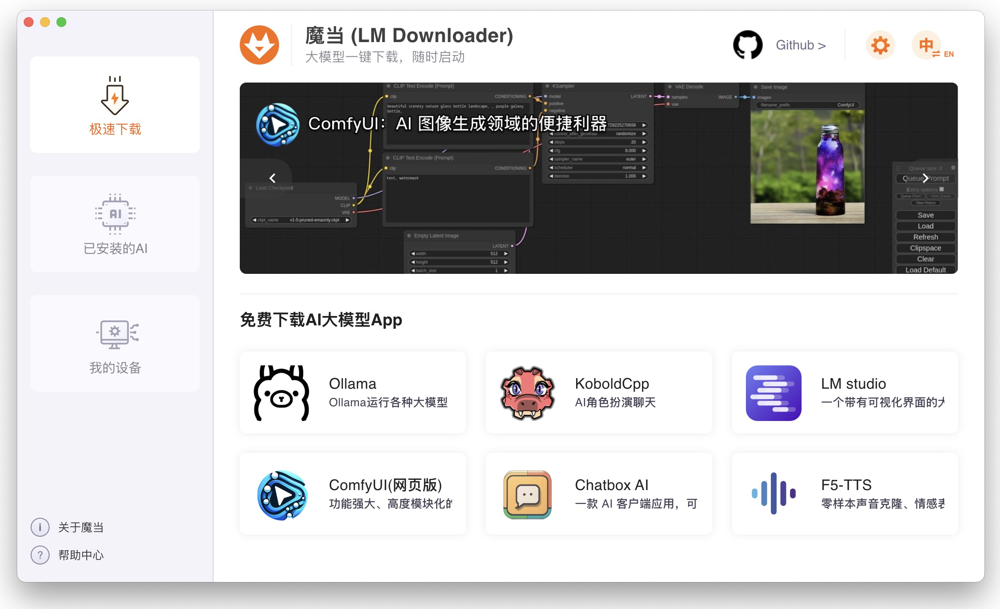
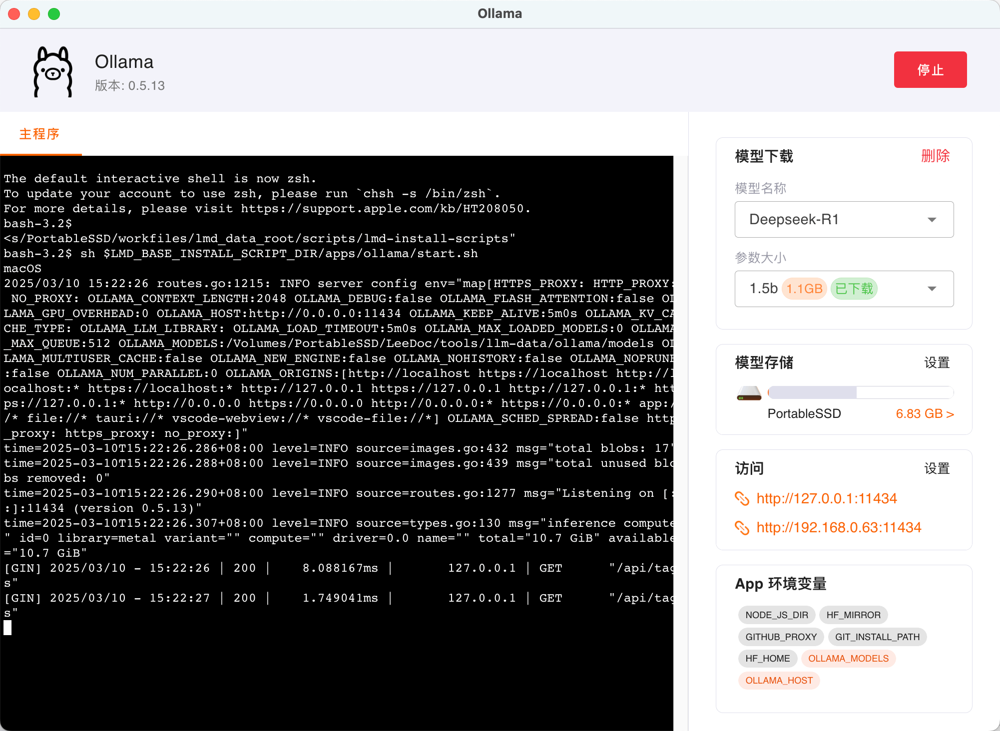
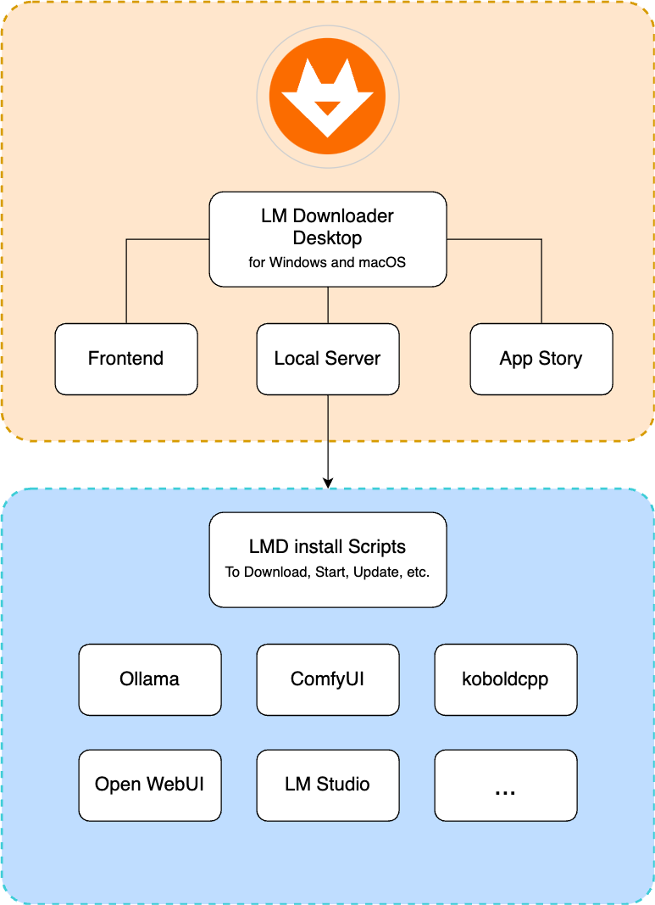

# 魔当桌面客户端 (LM Downloader Desktop)

魔当是一个免费，开源，易上手，且功能强大的AI大模型软件下载工具。

- 对于想在自己电脑上运行大模型的人，欢迎下载使用。
- 如果你是开发者，也欢迎提出意见和贡献代码，完善此工具。
- 如果你开发过大模型应用，可以提交到魔当社区，让更多人能快速下载和使用。

[English](./README.md) · 中文

## 🔗 链接
- [魔当首页](https://seemts.com)
- [下载 最新版 魔当](https://gitee.com/lmdown/lm-downloader-desktop/releases)

## 软件截图

#### 在魔当首页，能看到各种大模型App。



#### 在App详情页，查看介绍，可点击安装。


#### 如果安装了Ollama，可设置各种参数，可选择要下载的模型，你可以无需输入命令，实现所有操作。



## 推荐的开发工具

- [VSCode](https://code.visualstudio.com/) + [ESLint](https://marketplace.visualstudio.com/items?itemName=dbaeumer.vscode-eslint)

## 项目运行
本仓库是魔当的桌面客户端，使用Electron和TypeScript开发。

### 安装依赖

```bash
# 最常见的安装方式
npm i

# 如果访问npm官方的源太慢，可使用cnpm
cnpm i

# 或者加上--registry参数
npm i --registry=https://registry.npmmirror.com

# 还可以使用pnpm, yarn等工具安装依赖
yarn install

```

### 本地运行

请打开项目根目录的```.env```文件，如果想和其他几个项目完整地联调，那就保持```.env```不变。如果只是想快速看到运行效果，请修改，
```bash
# 前端项目的vite dev server，可以将其注释掉
# VITE_DEV_SERVER_URL=http://localhost:5173
# 是否用主进程运行本地的Node.js服务，改为1，就会在启动App时运行本地服务
START_LMD_SERVER=1
# 是否在启动时更新App数据，这个可以暂时不动
UPDATE_STORY=0
```

运行项目

```bash
npm run dev
```

### 构建

```bash
# For windows
npm run build:win

# For macOS
npm run build:mac

# For Linux
npm run build:linux
```

## 完整架构

以下是整个项目的架构图：



## 🔗 代码仓库链接

- [LM Downloader Desktop](https://gitee.com/lmdown/lm-downloader-desktop)
- [LM Downloader Frontend](https://gitee.com/lmdown/lm-downloader-frontend)
- [LM Downloader Local Server](https://gitee.com/lmdown/lm-downloader-local-server)
- [LM Downloader App Story](https://gitee.com/lmdown/lm-downloader-app-story)
- [LMD Install Scripts](https://gitee.com/lmdown/lm-downloader-app-story)


## 许可证

本项目采用 [Apache License 2.0](http://www.apache.org/licenses/LICENSE-2.0) 进行许可 - 版权 © 2025 lmdown

This project is licensed under the Apache License, Version 2.0 (the "License");
you may not use this file except in compliance with the License.
You may obtain a copy of the License at

    http://www.apache.org/licenses/LICENSE-2.0

Unless required by applicable law or agreed to in writing, software
distributed under the License is distributed on an "as is" basis,
WITHOUT WARRANTIES OR CONDITIONS OF ANY KIND, either express or implied.
See the License for the specific language that governs permissions and
limitations under the License.

# 魔当专业版

魔当专业版具备强大的高级特性，如果您需要使用专业版，或者有定制化需求，请联系我们 <lmdown@163.com>


**专业版特性**：

- 高级数据分析功能。
- 定制化选项。
- 自动化任务处理。
- 远程部署和管理。

除了强大的功能外，我们的专业版还提供全面的客户支持服务：
- 专属客服团队。
- 优先响应服务。
- 技术培训和指导。
- 持续更新和升级。
