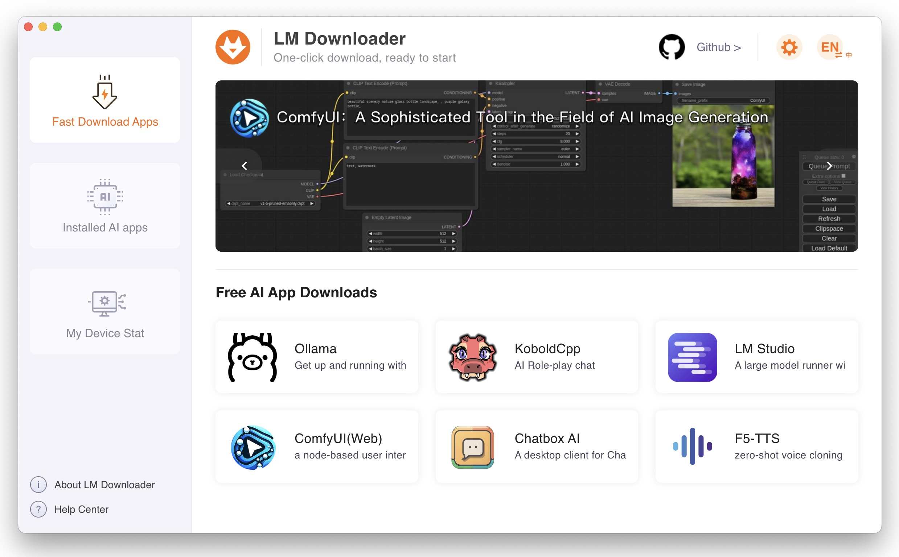
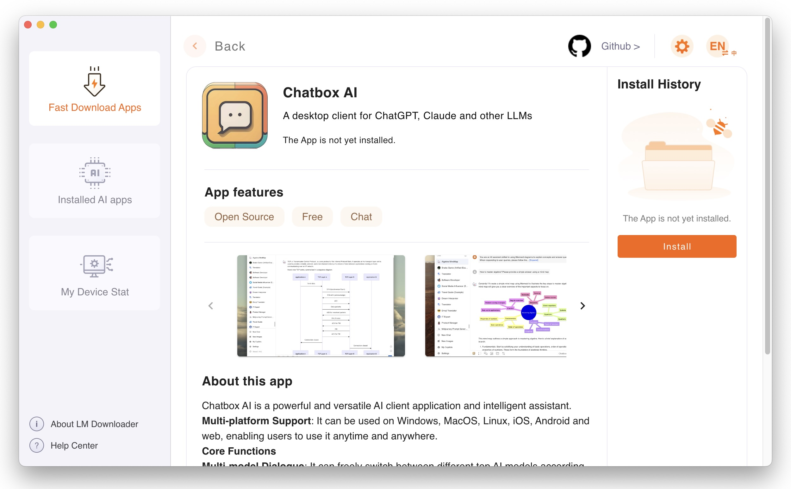
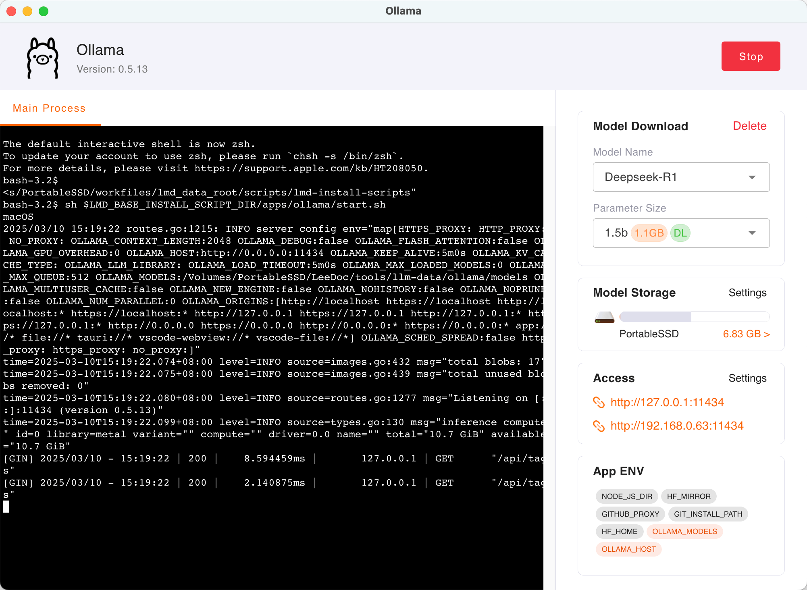

# LM Downloader Desktop (魔当)

LM Downloader is a easy-to-use, and powerful AI Large Model Apps downloading tool.

English · [中文](./README-zh.md)

## 🔗 Links
- [LM Downloader Homepage](https://seemts.com)
- [Github Releases](https://github.com/lmdown/lm-downloader-desktop/releases)

# Notice Regarding the Transition to Closed Source

Recently, we have received feedback from several users regarding malicious actors exploiting this project's open-source code. These individuals have been repackaging the software, selling it illegally through unauthorized third-party platforms, and even subjecting users to verbal abuse and fraudulent activities. To prevent further incidents and protect our users' rights, we have made the following decisions:

* **Discontinuation of Public Source Code:** Effective immediately, this project will transition from an open-source to a closed-source maintenance model.
* **Official Channels Only:** This repository's **Releases** page and our **Official Website** are the only trusted sources for downloading the software.
* **Legal Action:** We have collected and preserved evidence of these copyright infringements and reserve the right to pursue full legal action against the parties involved.

## Snapshots

#### On the homepage of LM Downloader, you can see various types of Large Model Apps.

#### View the introduction of the App, and click Install.

#### If Ollama is installed, you can change settings, and choose the models you want to download. Do it all without having to enter commands.

